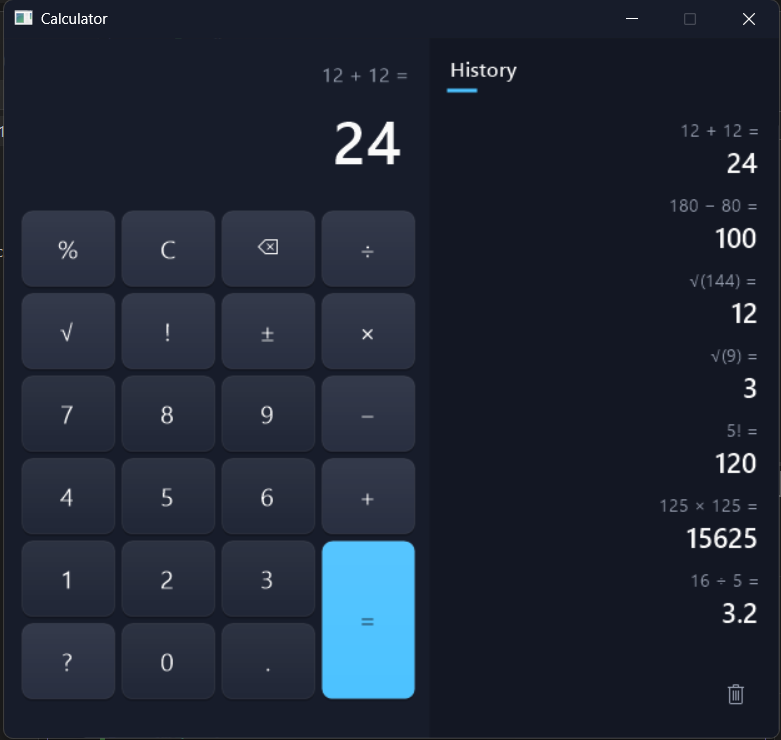

\# Calculator v3

Win32 GUI კალკულატორი, დაწერილი C++-ში. ინტერფეისი სრულად GDI+-ით იხატება, Windows 11-ის კალკულატორის სტილში.

\## ფუნქციები

\- არითმეტიკა: `+` `−` `×` `÷`, ათწილადი რიცხვები

\- `√` ფესვი, `!` ფაქტორიალი, `%` პროცენტი, `±` ნიშნის შეცვლა

\- ბოლო ციფრის წაშლა (Backspace)

\- ოპერაციების ჯაჭვი — `2 + 3 + 4 =`

\- შეცდომების დამუშავება — ნულზე გაყოფა, უარყოფითის ფესვი, არამთელის ფაქტორიალი; მიზეზი დისპლეიზე ჩანს

\- ისტორიის პანელი (უახლესი ზემოთ) და მისი გასუფთავება

\- გამოთვლების ჩაწერა `%LOCALAPPDATA%\Calculator\history.txt`-ში (UTF-8, დროის შტამპით)

\- კლავიატურის სრული მხარდაჭერა

\## ინტერფეისი

\- ერთი ფანჯარა — ღილაკები არ არის ცალკე Win32 კონტროლები, ყველაფერი ხელით იხატება

\- GDI+: გლუვი კიდეები (anti-aliasing), გრადიენტი, ჩრდილი

\- Hover და დაჭერის ეფექტი; დაჭერილი ღილაკიდან მაუსის გატანა მოქმედებას აუქმებს

\- Double buffering — მოციმციმეობის გარეშე

\- დისპლეის ფონტი ავტომატურად მცირდება გრძელ რიცხვებზე

\- მუქი სათაურის ზოლი (DWM)

\- სისტემური ხატულები (Segoe MDL2 Assets)

\## გამოყენებული ტექნოლოგიები

\- \*\*C++\*\*

\- \*\*Win32 API\*\* — User32

\- \*\*GDI+\*\* — ხატვა

\- \*\*DWM\*\* — მუქი სათაური

\- Visual Studio 2022

\## პროექტის აგება (Build)

1\. გახსენი `calculator v3.slnx` Visual Studio-ში

2\. Platform: \*\*x86\*\*

3\. Linker → System → SubSystem: \*\*Windows\*\*

4\. `Build → Build Solution` (`Ctrl+Shift+B`)

5\. გაშვებადი ფაილი: `Debug/calculator v3.exe`

`gdiplus.lib` და `dwmapi.lib` კოდშივეა მიერთებული (`#pragma comment`) — დამატებითი კონფიგურაცია არ სჭირდება.

\## კლავიატურა

| კლავიში | მოქმედება |

|---|---|

| `0`-`9`, `.` | რიცხვი |

| `+` `-` `\*` `/` | ოპერაციები |

| `Enter` / `=` | შედეგი |

| `Backspace` | ბოლო ციფრის წაშლა |

| `Esc` / `Delete` / `C` | გასუფთავება |

| `@` | ფესვი |

| `!` | ფაქტორიალი |

| `%` | პროცენტი |

| `F9` | ნიშნის შეცვლა |

| `F1` | დახმარება |

\## პროექტის სტრუქტურა

დეტალურად იხილეთ \[ARCHITECTURE.md](ARCHITECTURE.md).

\## ვერსიები

ერთი და იგივე კალკულატორი, სამ სხვადასხვა ენაზე:

\- \[Calculator](https://github.com/levanikotorashvili20-spec/Calculator) — x86 Assembly

\- \[calculator-v2](https://github.com/levanikotorashvili20-spec/calculator-v2) — C

\- \*\*calculator-v3\*\* — C++ (ეს პროექტი)

\## ავტორი

Levan Kotorashvili

GitHub: \[@levanikotorashvili20-spec](https://github.com/levanikotorashvili20-spec)

\## ლიცენზია

MIT — იხილეთ \[LICENSE](LICENSE).

